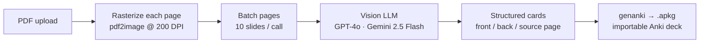
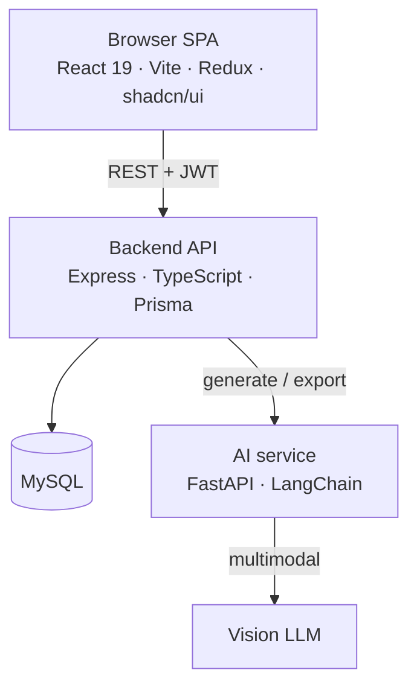

# Ankify

**Turn lecture PDFs into study-ready Anki flashcards in seconds — powered by vision AI.**

Upload a lecture slide deck → an AI reads every slide (including diagrams and figures) → you get clean, page-cited Q/A cards → export a ready-to-import Anki `.apkg`. What used to be an evening of manual card-making becomes a ~30-second round trip.


▶ [Full-quality MP4](assets/ankify-demo.mp4) · Built with React · Express · FastAPI · MySQL · GPT-4o / Gemini vision

---

## The user story

Med and PA students live in Anki, but building good cards from dense lecture PDFs is slow, manual busywork. Ankify closes that gap:

1. **Sign in** with Google.
2. **Upload** a lecture PDF and name the deck.
3. **Generate** — the AI reads each slide and writes concise question/answer cards, each tagged with the slide it came from.
4. **Review & edit** cards inline, then **export** a real `.apkg` and import it straight into Anki.

The whole loop is one screen and a few seconds — the demo above generates six page-cited dermatology cards from a real slide in one pass.

---

## How it works — the AI pipeline

The interesting part is turning a **visual** PDF (diagrams, tables, annotated figures) into good flashcards — not just scraping text.



- **Vision, not OCR.** Each page is rendered to an image at 200 DPI and sent to a multimodal model, so figures, tables, and hand-annotated slides are understood — not lost to text extraction.
- **Batched generation.** Slides are processed in batches (10 per call) to balance latency, cost, and context.
- **Pluggable model provider.** The vision LLM is swappable by env var between **GPT-4o** and **Google Gemini 2.5 Flash** with no code change — production ran Gemini for a ~4× cost reduction per deck.
- **Real Anki export.** Cards are packaged with `genanki` into a genuine `.apkg` (Basic Q/A note model), so the output drops into Anki with one click.

---

## Architecture

Three services, each with one job, talking over HTTP:



- **Frontend** — React 19 + TypeScript SPA (Vite, Redux Toolkit, React Router). UI is built on a **shadcn/ui + Tailwind** design system. Google OAuth login, drag-and-drop upload, live generation status, inline card editor, one-click export.
- **Backend** — Express + TypeScript API. Owns auth (JWT + Google OAuth), file uploads (multer), deck/card CRUD (Prisma + MySQL), and orchestration: it calls the AI service to generate, polls status, and streams the `.apkg` back. Storage is pluggable (local filesystem by default, S3-compatible optional).
- **AI service** — FastAPI + LangChain. Stateless; runs the vision pipeline above and returns structured cards. Isolated so the model/provider can change without touching the app.

---

## Hosting & deployment

- **Frontend:** Vercel (`ankify.io`).
- **Backend + AI service + MySQL:** a single AWS EC2 box, each process managed by **PM2**, fronted by **Nginx** with TLS (`api.ankify.io`).
- **Deploy:** one script — `git pull` → `prisma migrate deploy` → `prisma generate` → build → `poetry install` → `pm2 restart`.
- **CI:** GitHub Actions gates every PR on lint, type-check, and a **Playwright end-to-end suite** (real app + a deterministic mock AI). A separate live-smoke workflow exercises the *real* OpenAI pipeline on merge to `main`.

---

## Engineering highlights

- **End-to-end tested from the UI down.** Playwright drives the real frontend against the real backend + MySQL, with a stubbed AI for deterministic, free CI runs — plus one live-generation canary against real OpenAI.
- **Design system.** Migrated the whole frontend onto shadcn/ui + Tailwind tokens for a consistent, themeable UI.
- **Cost engineering.** Pluggable vision provider let production swap GPT-4o → Gemini 2.5 Flash for ~4× cheaper decks with comparable quality.
- **Production hardening.** Page-at-a-time PDF streaming to bound memory after a real OOM incident on the single-box deployment.

---

## Project status — sunset (finished MVP)

Ankify started as a tool for friends in med school. They've since moved off Anki, so I've **sunset it as a finished MVP** and kept it as a portfolio piece — the architecture, the AI pipeline, and the infra are the point. The hosted instance has been taken offline to stop incurring cost; the demo above shows it running end-to-end. The design system and test/CI harness mean it could be picked back up cleanly if there were ever a reason to.

---

## Run it locally

**Prereqs:** Node 20+, Yarn, Python 3.11+, Poetry, Docker, an OpenAI (or Google) API key.

1. **Database** — from repo root: `docker compose up -d`
2. **Services** — copy each `*.env.example` to `.env` once, then run (three terminals):

   ```bash
   cd backend && npm install && npx prisma migrate dev && npm run dev
   ```

   ```bash
   cd ai-server && poetry install && poetry run uvicorn app.main:app --reload --port 8000
   ```

   ```bash
   cd frontend && yarn install && yarn dev
   ```

App: **http://localhost:5173** · API: **3000** · AI: **8000** · MySQL: **3306**

**End-to-end tests:** `cd e2e && npm install && npx playwright test`

Deep-dive docs: architecture & env in [`knowledge/engineering/AGENT.md`](./knowledge/engineering/AGENT.md), the dev lifecycle in [`knowledge/engineering/SDLC.md`](./knowledge/engineering/SDLC.md), release steps in [`knowledge/engineering/RELEASE_CHECKLIST.md`](./knowledge/engineering/RELEASE_CHECKLIST.md).
